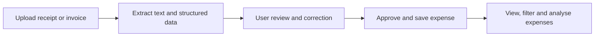
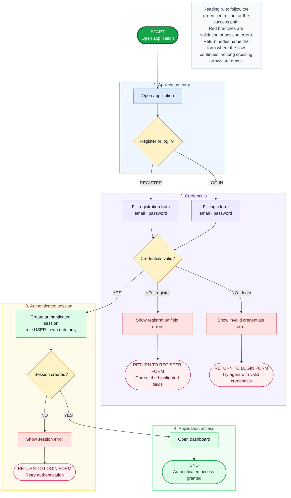
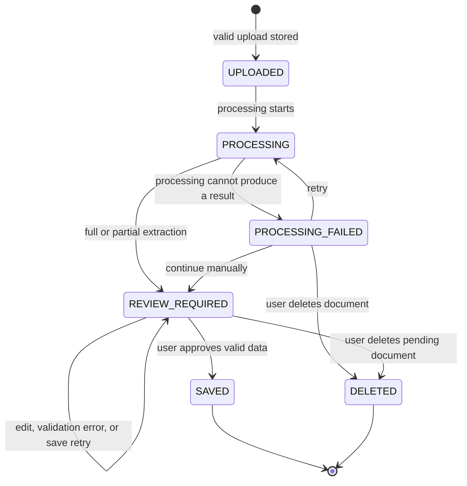

# AI Finance Tracker — Architecture Documentation

> **Status:** Working draft  
> **Last updated:** 2026-07-14  
> This document evolves together with the implementation. It records decisions that are currently accepted and separates them from open questions.

## 1. Product vision

AI Finance Tracker is a web application for personal expense tracking. A user uploads a receipt or invoice, the system extracts the main financial information, the user reviews and corrects it, and the confirmed expense is stored and included in lists, filters, and dashboard statistics.

The product reduces manual data entry while keeping the user in control of the final saved data.

### Core value flow



## 2. Problem being solved

Financial information from receipts and invoices is usually unstructured, scattered across paper documents, images, PDFs, and email attachments. Manual entry is slow and discourages consistent expense tracking.

The system transforms an unstructured document into a verified structured expense:

```text
Document → OCR text → proposed structured fields → user verification → saved expense
```

The system is not intended to be accounting software. In the MVP, receipts and invoices are treated as evidence for personal expenses, not as complete accounting objects.

## 3. Target users

### Primary MVP user

An individual who wants to track personal expenses without manually entering every record.

Examples include students, young professionals, and users who already keep or photograph receipts.

### Possible later user

A freelancer or self-employed person who wants to organise business-related expense documents. Tax, VAT, approval, and accounting workflows are outside the MVP.

## 4. MVP scope

### Included

- User registration, login, and logout.
- One application role: `USER`.
- Upload of supported image and PDF files.
- Secure association of every document and expense with its owner.
- OCR text extraction.
- Extraction of merchant, date, total amount, currency, and category.
- Review and correction before final saving.
- Manual entry when automatic extraction is incomplete or fails.
- Storage of the original document and the confirmed expense data.
- Expense list, details, edit, and delete operations.
- Filters by period, category, and merchant.
- A basic dashboard with aggregated expense information.
- Basic automated tests and Docker-based local setup.

### Explicitly excluded

- Administrator profile and admin panel.
- Line-item extraction from receipts.
- Accounting and tax calculations.
- Bank integrations.
- Mobile application.
- Teams, organisations, and multiple user roles.
- Microservices and Kubernetes.
- A custom AI model trained from scratch.
- Natural-language querying in the first release.
- Guaranteed perfect recognition of every document format.

## 5. Core user journeys

### Flow A — Authentication

The user registers, logs in, and obtains access only to their own documents and expenses.



### Flow B — Document processing

The user uploads a document, the system processes it, the user reviews the proposed fields, and an expense is saved only after explicit approval.

### Flow C — Expense exploration

The user opens the expense list, filters expenses, views details, edits existing records, and sees aggregated information in the dashboard.

```mermaid
flowchart TB
    %% Flow C — Expense exploration and dashboard
    %% Expense fields in MVP: merchant · date · total · currency · category
    %% derived from a saved Document. Dashboard summaries are calculated
    %% from saved expenses; they are not a separate source of truth.
    %% Layout: green centre line = success path. Side branches = filters,
    %% empty results, edit/delete alternatives. No long crossing arrows.

    start(["START<br/>Authenticated user"])

    subgraph dashboard["1. Dashboard"]
        direction TB
        open_dash["Open dashboard"]
        load_own["Load only the current user's<br/>saved expenses"]
        view_summary["View expense summary<br/>calculated from saved expenses"]
        show_widgets["Show period total · by category ·<br/>by merchant · recently added documents"]
        go_list["Open expense list"]

        open_dash --> load_own --> view_summary --> show_widgets --> go_list
    end

    start --> open_dash

    subgraph listing["2. Expense list and filters"]
        direction TB
        list_view["Show expense list<br/>merchant · date · total · currency · category"]
        apply_filters["Apply optional filters<br/>date from/to · category · merchant"]
        filters_valid{"Filters valid?"}
        filter_error["Show filter validation errors"]
        return_filters(["RETURN TO FILTERS<br/>Correct date range or criteria"])
        show_results{"Matching expenses found?"}
        empty_state["Show empty state<br/>No expenses found"]
        clear_filters["Clear filters"]
        return_list_empty(["RETURN TO LIST<br/>After clearing filters"])
        results["View matching expenses"]

        list_view --> apply_filters --> filters_valid
        filters_valid -->|NO| filter_error
        filter_error --> return_filters
        filters_valid -->|YES| show_results
        show_results -->|NO| empty_state
        empty_state --> clear_filters --> return_list_empty
        show_results -->|YES| results
    end

    go_list --> list_view

    subgraph details["3. Expense details"]
        direction TB
        open_details["Open expense details"]
        show_doc["Show confirmed fields beside<br/>the original uploaded Document"]
        user_action{"User action"}

        open_details --> show_doc --> user_action
    end

    results --> open_details

    subgraph actions["4. Edit, delete or return"]
        direction TB
        edit_form["Edit expense fields<br/>merchant · date · total · currency · category"]
        edit_valid{"Edited data valid?"}
        edit_error["Show field-level errors"]
        return_edit(["RETURN TO EDIT FORM<br/>Correct the highlighted fields"])
        save_edit["Save updated expense"]
        confirm_delete{"Confirm delete?"}
        cancel_delete(["RETURN TO DETAILS<br/>Deletion cancelled"])
        delete_expense["Delete expense"]
        refresh_stats["Recalculate dashboard summary<br/>from remaining saved expenses"]
        return_list["Return to expense list"]
        end_ok(["END<br/>Exploration complete"])

        edit_form --> edit_valid
        edit_valid -->|NO| edit_error
        edit_error --> return_edit
        edit_valid -->|YES| save_edit
        save_edit --> refresh_stats

        confirm_delete -->|NO| cancel_delete
        confirm_delete -->|YES| delete_expense
        delete_expense --> refresh_stats

        refresh_stats --> return_list
        return_list --> end_ok
    end

    user_action -->|EDIT| edit_form
    user_action -->|DELETE| confirm_delete
    user_action -->|RETURN| return_list

    legend["Reading rule: follow the green centre line for the success path.<br/>Red branches are validation errors. Grey/orange branches are empty results or cancelled delete.<br/>Dashboard statistics are always recalculated from saved expenses, never stored as the source of truth."]

    classDef startNode fill:#16a34a,stroke:#14532d,stroke-width:3px,color:#fff
    classDef action fill:#ffffff,stroke:#94a3b8,color:#0f172a
    classDef dashAction fill:#dbeafe,stroke:#3b82f6,color:#0f172a
    classDef listAction fill:#ede9fe,stroke:#8b5cf6,color:#0f172a
    classDef detailAction fill:#fef3c7,stroke:#d97706,color:#0f172a
    classDef saveAction fill:#dcfce7,stroke:#16a34a,color:#0f172a
    classDef decision fill:#fef3c7,stroke:#d97706,color:#0f172a
    classDef error fill:#fee2e2,stroke:#ef4444,color:#7f1d1d
    classDef restart fill:#fff1f2,stroke:#e11d48,color:#881337
    classDef emptyAlt fill:#fff7ed,stroke:#f97316,color:#9a3412
    classDef pause fill:#e0f2fe,stroke:#0284c7,color:#075985
    classDef endNode fill:#dcfce7,stroke:#16a34a,stroke-width:2px,color:#14532d
    classDef deleteAction fill:#f1f5f9,stroke:#64748b,color:#0f172a
    classDef legendBox fill:#f8fafc,stroke:#cbd5e1,color:#334155

    class start startNode
    class open_dash,load_own,view_summary,show_widgets,go_list dashAction
    class list_view,apply_filters,results listAction
    class open_details,show_doc,edit_form detailAction
    class save_edit,refresh_stats,return_list saveAction
    class filters_valid,show_results,user_action,edit_valid,confirm_delete decision
    class filter_error,edit_error error
    class return_filters,return_edit,cancel_delete restart
    class empty_state,clear_filters,return_list_empty emptyAlt
    class delete_expense deleteAction
    class end_ok endNode
    class legend legendBox

    style dashboard fill:#eff6ff,stroke:#93c5fd,stroke-width:2px,color:#1e3a8a
    style listing fill:#f5f3ff,stroke:#c4b5fd,stroke-width:2px,color:#5b21b6
    style details fill:#fffbeb,stroke:#fde68a,stroke-width:2px,color:#92400e
    style actions fill:#f0fdf4,stroke:#86efac,stroke-width:2px,color:#166534
```



---

# 6. Flow B — Document processing

## 6.1 Goal

Convert a user-provided receipt or invoice into a valid, user-approved expense without silently trusting OCR or AI output.

## 6.2 Preconditions

- The user is authenticated.
- The user is allowed to upload a document.
- The selected file uses a supported format and is within the configured size limit.

## 6.3 Successful path

1. The user opens the upload page and selects a file.
2. The frontend performs an initial format and size check.
3. The file is uploaded to the backend.
4. The backend authenticates the request and repeats all security and file validations.
5. The original file is stored and a document record is created with status `UPLOADED`.
6. The document status changes to `PROCESSING`.
7. OCR extracts raw text from the document.
8. The extraction component converts the raw text into proposed structured fields:
   - merchant;
   - date;
   - total amount;
   - currency;
   - category.
9. The backend validates and normalises the proposed values.
10. The document status changes to `REVIEW_REQUIRED`.
11. The frontend displays the original document next to an editable form.
12. The user checks and corrects the proposed values.
13. The user explicitly approves the data.
14. The backend validates the corrected data again.
15. In one consistent save operation, the backend:
    - creates the expense;
    - links it to the document and owner;
    - stores the confirmed values;
    - changes the document status to `SAVED`.
16. The user is redirected to the saved expense details.
17. The new expense becomes visible in the expense list, filters, and dashboard calculations.

## 6.4 Alternative and failure paths

### Invalid file before upload

The frontend rejects an unsupported type or oversized file and asks the user to select another one. No document is created.

### Invalid or unsafe file detected by the backend

The backend rejects the upload even if the frontend accepted it. Client-side validation is only a usability feature and is never trusted as the security boundary.

### File storage fails

The upload is rejected, incomplete data is cleaned up, and the user receives a retryable error. No usable document record should remain orphaned.

### OCR returns partial text

The system continues with the available text. Extracted fields may be incomplete, but the user still reaches the review form and can fill them manually.

### OCR or structured extraction fails completely

The document is marked `PROCESSING_FAILED`. The user can:

- retry processing;
- continue with an empty manual form;
- delete the uploaded document.

A failed AI operation must not permanently block manual expense creation.

### Extracted values are invalid or ambiguous

The system does not save them automatically. Invalid fields are left empty or marked for attention on the review screen.

Examples:

- no total amount was found;
- the date cannot be parsed;
- the currency is unsupported;
- the merchant name is missing.

### User leaves the review page

The document remains in `REVIEW_REQUIRED`, and the user can return later. No expense is included in statistics before approval.

### User deletes the pending document

The pending record and its stored file are removed according to the storage cleanup rules. No expense is created.

### Final validation fails

The review form is shown again with field-level errors. The document remains in `REVIEW_REQUIRED`.

### Database save fails

The expense must not be partially created. The document remains available for review and retry, and the user receives an error message.

## 6.5 Detailed activity diagram

```mermaid
flowchart TB
    %% Flow B — Document processing
    %% Layout: blue/green centre line = normal path.
    %% Red = errors. Orange = manual alternatives.
    %% Restart / return / continue nodes name the next step; no long backward arrows.

    start(["START<br/>Open Upload page"])

    subgraph upload["1. Upload and validation"]
        direction TB
        select["Select image or PDF"]
        client_check{"Frontend format and size<br/>check passes?"}
        upload_file["Upload file to backend"]
        server_check{"Authentication and backend<br/>validation pass?"}
        store["Store original file and<br/>create Document (UPLOADED)"]
        storage_ok{"Storage succeeds?"}

        file_error["Show unsupported type or<br/>file-size error"]
        request_error["Reject request and<br/>show authentication or validation error"]
        storage_error["Clean partial data and<br/>show retryable storage error"]

        retry_upload_1(["RESTART<br/>Begin again from file selection"])
        retry_upload_2(["RESTART<br/>Begin again from file selection"])
        retry_upload_3(["RESTART<br/>Begin again from file selection"])

        select --> client_check
        client_check -->|YES| upload_file
        client_check -->|NO| file_error
        file_error --> retry_upload_1

        upload_file --> server_check
        server_check -->|YES| store
        server_check -->|NO| request_error
        request_error --> retry_upload_2

        store --> storage_ok
        storage_ok -->|NO| storage_error
        storage_error --> retry_upload_3
    end

    start --> select

    subgraph processing["2. Automated processing"]
        direction TB
        set_processing["Set status PROCESSING"]
        ocr["Run OCR"]
        ocr_check{"OCR result usable?"}
        extract["Extract proposed fields<br/>merchant · date · total · currency · category"]
        normalize["Validate and normalise<br/>proposed values"]
        review_required["Set status REVIEW_REQUIRED"]

        failed["Set status PROCESSING_FAILED"]
        failed_choice{"User decision"}
        manual["Open an empty manual form"]
        delete_failed["Delete pending Document<br/>and stored file"]

        retry_processing(["RESTART<br/>Begin again from PROCESSING"])
        continue_manual(["CONTINUE AT SECTION 3<br/>User review with an empty form"])
        no_expense_1(["END<br/>No expense created"])

        set_processing --> ocr --> ocr_check
        ocr_check -->|YES / PARTIAL| extract
        extract --> normalize --> review_required

        ocr_check -->|NO| failed
        failed --> failed_choice
        failed_choice -->|RETRY| retry_processing
        failed_choice -->|MANUAL| manual
        failed_choice -->|DELETE| delete_failed
        manual --> continue_manual
        delete_failed --> no_expense_1
    end

    storage_ok -->|YES| set_processing

    subgraph review["3. User review"]
        direction TB
        show_review["Show the original document beside<br/>an editable form"]
        user_action{"User action"}
        approve["Approve proposed or<br/>corrected data"]
        validate{"Confirmed data valid?"}
        field_errors["Show field-level errors"]
        delete_review["Delete pending Document<br/>and stored file"]

        resume_review(["PAUSED<br/>Resume later from the review screen"])
        return_review_1(["RETURN TO REVIEW<br/>Correct the highlighted fields"])
        no_expense_2(["END<br/>No expense created"])

        show_review --> user_action
        user_action -->|APPROVE| approve
        user_action -->|LEAVE| resume_review
        user_action -->|DELETE| delete_review
        delete_review --> no_expense_2

        approve --> validate
        validate -->|NO| field_errors
        field_errors --> return_review_1
    end

    review_required --> show_review
    continue_manual --> show_review

    subgraph save["4. Final save"]
        direction TB
        create_expense["Atomically create Expense, link Document,<br/>and store confirmed values"]
        save_check{"Database save succeeds?"}
        set_saved["Set Document status SAVED"]
        open_details["Open saved expense details"]
        success(["SUCCESS<br/>Expense appears in details, list,<br/>filters and dashboard"])
        save_error["Keep review data and<br/>show retry option"]
        return_review_2(["RETURN TO REVIEW<br/>Retry after the save error"])

        create_expense --> save_check
        save_check -->|YES| set_saved
        set_saved --> open_details --> success
        save_check -->|NO| save_error
        save_error --> return_review_2
    end

    validate -->|YES| create_expense

    legend["Reading rule: follow the blue/green centre line for the normal path.<br/>Red branches are errors. Orange branches are manual alternatives.<br/>Restart and return nodes name the step where the flow continues; no long backward arrows are drawn."]

    %% Node colours matching the SVG palette
    classDef startNode fill:#16a34a,stroke:#14532d,stroke-width:3px,color:#fff
    classDef action fill:#ffffff,stroke:#94a3b8,color:#0f172a
    classDef uploadAction fill:#dbeafe,stroke:#3b82f6,color:#0f172a
    classDef processAction fill:#ede9fe,stroke:#8b5cf6,color:#0f172a
    classDef decision fill:#fef3c7,stroke:#d97706,color:#0f172a
    classDef reviewGate fill:#fef9c3,stroke:#ca8a04,stroke-width:2px,color:#0f172a
    classDef reviewAction fill:#fef3c7,stroke:#d97706,color:#0f172a
    classDef saveAction fill:#dcfce7,stroke:#16a34a,color:#0f172a
    classDef successNode fill:#dcfce7,stroke:#16a34a,stroke-width:2px,color:#14532d
    classDef error fill:#fee2e2,stroke:#ef4444,color:#7f1d1d
    classDef restart fill:#fff1f2,stroke:#e11d48,color:#881337
    classDef orangeAlt fill:#fff7ed,stroke:#f97316,color:#9a3412
    classDef orangeAction fill:#ffedd5,stroke:#f97316,color:#0f172a
    classDef pause fill:#e0f2fe,stroke:#0284c7,color:#075985
    classDef endNeutral fill:#f1f5f9,stroke:#64748b,color:#334155
    classDef deleteAction fill:#f1f5f9,stroke:#64748b,color:#0f172a
    classDef legendBox fill:#f8fafc,stroke:#cbd5e1,color:#334155

    class start startNode
    class select action
    class upload_file,store uploadAction
    class set_processing,ocr,extract,normalize processAction
    class client_check,server_check,storage_ok,ocr_check,user_action,validate,save_check decision
    class failed_choice orangeAction
    class review_required reviewGate
    class show_review,approve reviewAction
    class create_expense,set_saved,open_details saveAction
    class success successNode
    class file_error,request_error,storage_error,failed,field_errors,save_error error
    class retry_upload_1,retry_upload_2,retry_upload_3,return_review_1,return_review_2 restart
    class retry_processing,continue_manual,manual orangeAlt
    class resume_review pause
    class no_expense_1,no_expense_2 endNeutral
    class delete_failed,delete_review deleteAction
    class legend legendBox

    %% Section background colours
    style upload fill:#eff6ff,stroke:#93c5fd,stroke-width:2px,color:#1e3a8a
    style processing fill:#f5f3ff,stroke:#c4b5fd,stroke-width:2px,color:#5b21b6
    style review fill:#fffbeb,stroke:#fde68a,stroke-width:2px,color:#92400e
    style save fill:#f0fdf4,stroke:#86efac,stroke-width:2px,color:#166534
```



## 6.6 Document status model

The following status names are a preliminary domain model. Their exact implementation can change when the database model is designed.



## 6.7 Functional rules

1. Automatic extraction never creates a final expense by itself.
2. Explicit user approval is required before an expense affects lists or statistics.
3. All important validations are repeated on the backend.
4. A user can access only documents and expenses that they own.
5. Partial extraction is considered useful and should lead to manual review, not failure.
6. Complete processing failure must still allow manual entry.
7. The final expense save must be atomic: either the complete expense is saved, or no partial expense remains.
8. Pending and failed documents are excluded from dashboard calculations.
9. The original document and the confirmed structured data remain linked.
10. Technical error details are logged, while the user receives a safe and understandable message.

## 6.8 Required fields before approval

The exact database constraints will be decided later. For the MVP, the expected minimum is:

- expense date;
- total amount greater than zero;
- supported currency;
- category;
- authenticated owner.

Merchant may remain optional when it cannot be recognised or is not present on the document.

## 6.9 Preliminary domain concepts

### Document

Represents the uploaded original file and its processing lifecycle. It belongs to one user and has a processing status.

### Extraction result

Represents automatically proposed values and possibly the raw OCR text. It is not trusted as final financial data.

### Expense

Represents the user-approved financial record used by lists, filters, and dashboard calculations.

Separating `Document` from `Expense` prevents failed or unapproved uploads from appearing as real expenses.

## 6.10 Completion criteria for Flow B

Flow B is complete when a user can:

1. upload a valid real-world document;
2. receive full, partial, or failed extraction feedback;
3. reach a review form in all recoverable cases;
4. correct or manually enter the required data;
5. approve and save a valid expense;
6. return later to an unfinished review;
7. see the saved expense in the expense list and dashboard;
8. never see an unapproved document counted as an expense.

## 6.11 Open implementation decisions

These questions are deliberately postponed until the relevant architecture and technology phases:

- Exact supported file types and maximum file size.
- Whether PDF support includes only digital PDFs or also scanned PDFs.
- Whether processing is synchronous or performed by a background job.
- Which OCR engine or service is used.
- Which AI extraction approach is used.
- Whether raw OCR text is stored and for how long.
- File storage location: local volume, object storage, or cloud service.
- Retry limits and timeout behaviour.
- Retention and deletion policy for original files.
- Exact category set and whether categories are configurable.
- Whether field-level confidence scores are introduced after the MVP.

---

# 7. Initial architectural principles

The following principles are accepted for the project:

- **Human-in-the-loop:** AI proposes; the user confirms.
- **Backend as trust boundary:** security and business validation do not depend on the frontend.
- **Graceful degradation:** partial or failed AI processing falls back to manual entry.
- **Clear ownership:** every document and expense belongs to exactly one user in the MVP.
- **No premature overengineering:** infrastructure and AI complexity are added only when justified by a real requirement.
- **Documentation follows reality:** this document must be updated when implementation decisions change.

# 8. Change log

| Date | Change |
|---|---|
| 2026-07-16 | Added Flow A authentication and Flow C expense exploration activity diagrams. |
| 2026-07-14 | Created the initial architecture draft and defined Flow B for document processing. |
