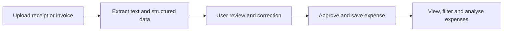
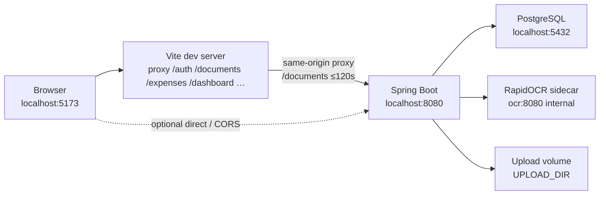
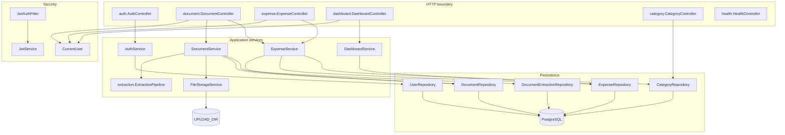
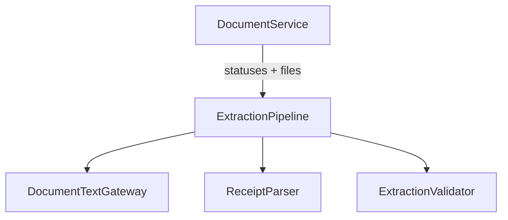
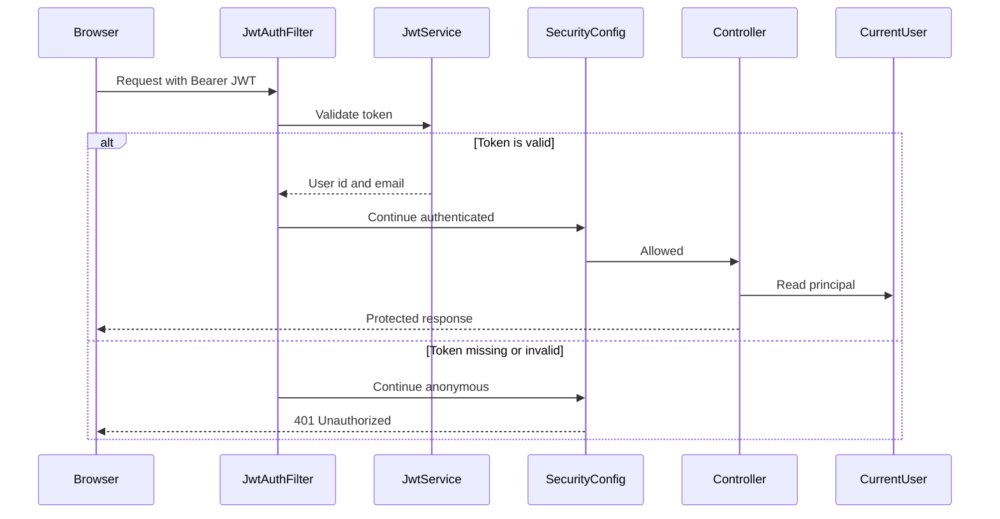
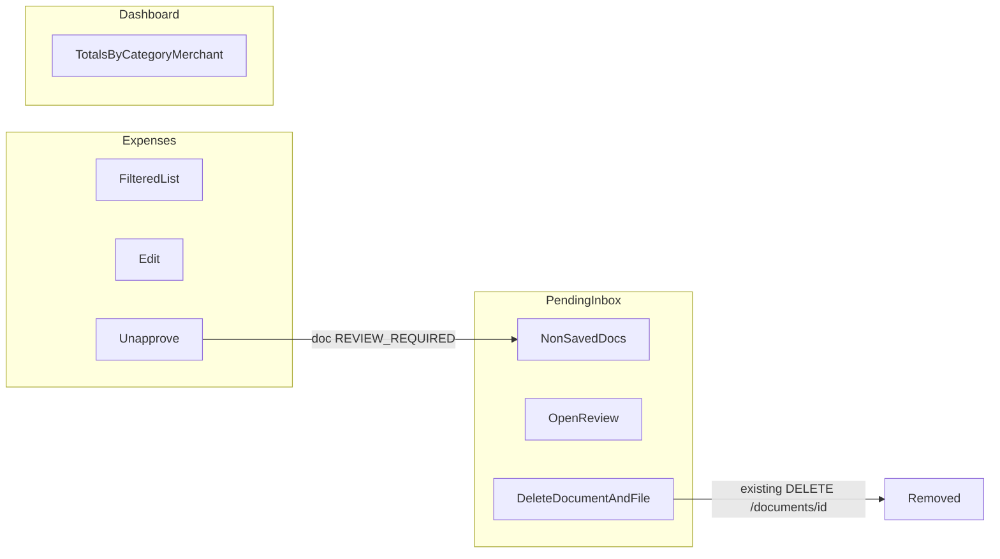
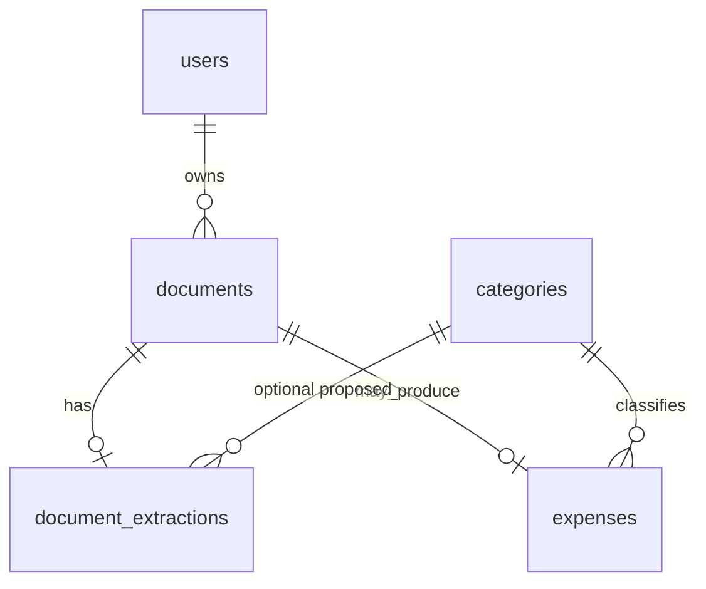

# AI Finance Tracker — Architecture Documentation

> **Status:** MVP documentation (demo-ready)  
> **Last updated:** 2026-09-23  
> This document records accepted decisions and how the system is built. Detail diagrams live under [`diagrams/`](diagrams/).

## Contents

1. [Product vision](#1-product-vision)
2. [Problem and users](#2-problem-and-users)
3. [MVP scope](#3-mvp-scope)
4. [System shape](#4-system-shape) — stack, deployment, packages, frontend, API
5. [Flow A — Authentication](#5-flow-a--authentication)
6. [Flow B — Document processing](#6-flow-b--document-processing)
7. [Flow C — Expense exploration](#7-flow-c--expense-exploration)
8. [Data model](#8-data-model)
9. [Open decisions](#9-open-decisions)
10. [Principles](#10-principles)
11. [Change log](#11-change-log)

---

## 1. Product vision

AI Finance Tracker is a web app for personal expense tracking. A user uploads a receipt or invoice, the system proposes the main financial fields, the user reviews and corrects them, and the confirmed expense is stored for lists, filters, and a dashboard.

The product reduces manual data entry while keeping the user in control of the final saved data.


```mermaid
flowchart LR
    A[Upload receipt or invoice] --> B[Extract text and structured data]
    B --> C[User review and correction]
    C --> D[Approve and save expense]
    D --> E[View, filter and analyse expenses]
```

---

## 2. Problem and users

Receipts and invoices are unstructured (paper, photos, PDFs). Manual entry is slow. The MVP turns a document into a verified structured expense:

```text
Document → text (PDFBox and/or OCR) → proposed fields → user verification → saved expense
```

It is not accounting software. Receipts are evidence for personal expenses, not full accounting objects.

**Primary MVP user:** an individual who wants to track personal spending (students, young professionals, people who already photograph receipts).

**Later possibility:** freelancers organising business expenses. Tax, VAT, teams, and multi-role workflows are outside the MVP.

---

## 3. MVP scope

### Included

- User registration, login, and logout.
- One application role: `USER`.
- Upload of supported image and PDF files.
- Secure association of every document and expense with its owner.
- Text extraction from digital PDFs (PDFBox) and from images/scans (RapidOCR sidecar).
- Extraction of merchant, date, total amount, currency (**EUR only**), and category.
- Review and correction before final saving.
- Manual entry when automatic extraction is incomplete or fails.
- Storage of the original document and the confirmed expense data.
- Expense list, details, edit, and **unapprove** (remove expense row; document → `REVIEW_REQUIRED`; file kept). Forever wipe of a document + file is only from the pending inbox (`DELETE /documents/{id}`).
- Filters by period, category, and merchant (AND-combined).
- A basic dashboard with **aggregates only** (totals by currency / category / merchant; no recent-list widgets).
- Pending-documents inbox (`GET /documents?status=pending`) to resume review or forever-delete.
- Basic automated tests and Docker-based local setup.

### Explicitly excluded

- Administrator profile and admin panel.
- Line-item extraction from receipts.
- Accounting and tax calculations.
- Bank integrations.
- Mobile application.
- Teams, organisations, and multiple user roles.
- Microservices and Kubernetes.
- A custom AI model trained from scratch.
- Natural-language querying in the first release.
- Guaranteed perfect recognition of every document format.

---

## 4. System shape

### 4.1 Technology stack

| Layer | Choice |
| ----- | ------ |
| Backend | Java 21+, Spring Boot 3, REST JSON |
| Auth | JWT bearer (Spring Security), BCrypt password hashes |
| Validation | Jakarta Bean Validation on request DTOs |
| Persistence | Spring Data JPA; schema owned by SQL in `db/migrations/` (`ddl-auto=none`) |
| Database | PostgreSQL 16 |
| PDF text | Apache PDFBox (digital text layer + page rasterize for scans) |
| OCR | RapidOCR sidecar (HTTP, Compose `ocr` service; Java `HttpOcrClient`) |
| Receipt parse | LLM on **text only** via **Groq Cloud** (`openai/gpt-oss-120b` default; OpenAI-compatible HTTP; `GroqReceiptParser`) |
| Frontend | Vite + plain JavaScript (hash routing + `fetch`) |
| Files | Local disk under `UPLOAD_DIR` (Docker volume in Compose) |
| Currency | **EUR only** (column kept; UI submits `EUR`) |
| Local run | Docker Compose for Postgres + OCR sidecar + backend; frontend on the host |

### 4.2 Deployment (local)


```mermaid
flowchart LR
    Browser["Browser<br/>localhost:5173"]
    Vite["Vite dev server<br/>proxy /auth /documents /expenses /dashboard …"]
    API["Spring Boot<br/>localhost:8080"]
    PG["PostgreSQL<br/>localhost:5432"]
    OCR["RapidOCR sidecar<br/>ocr:8080 internal"]
    Disk["Upload volume<br/>UPLOAD_DIR"]

    Browser --> Vite
    Vite -->|"same-origin proxy<br/>/documents ≤120s"| API
    Browser -.->|"optional direct / CORS"| API
    API --> PG
    API --> OCR
    API --> Disk
```

- **Compose today** (`docker-compose.yml`): `postgres` + internal `ocr` (RapidOCR) + `backend`. Migrations mount into `docker-entrypoint-initdb.d` (run only when the Postgres volume is first created). Apply later migrations (for example `003_currency_eur_only.sql`) once with `psql` — see [`db/README.md`](../db/README.md). Preferred clone path: [`scripts/setup.ps1`](../scripts/setup.ps1) / [`scripts/setup.sh`](../scripts/setup.sh) (env copy, Compose up, health wait, `npm install`).
- Backend calls OCR via `OCR_BASE_URL` (default `http://ocr:8080`; port not published to the host). Images stay on our disk; the LLM receives text only.
- **Timeouts (sync processing):** OCR HTTP read ~30s (`OCR_TIMEOUT_MS`); Groq chat ~20s (`GROQ_TIMEOUT_MS`); Tomcat `connection-timeout` 120s; Vite `/documents` proxy 120s. Processing can take several seconds end-to-end.
- **Frontend** is not in Compose: `cd frontend && npm run dev`.
- Env values come from `.env` (see `.env.example`): DB credentials, `JWT_SECRET`, `UPLOAD_DIR`, JDBC URL, `OCR_BASE_URL`, `OCR_TIMEOUT_MS`, `GROQ_API_KEY`, `GROQ_API_BASE_URL`, `GROQ_MODEL`, `GROQ_TIMEOUT_MS`.

How requests move:

1. The SPA calls paths like `/documents` (relative).
2. Vite proxies them to the backend, so the browser avoids CORS during normal local use.
3. `SecurityConfig` + `WebConfig` still allow `http://localhost:5173` if the API is called directly.
4. Protected handlers read the user from the JWT via `CurrentUser` (never from a body `userId`).

### 4.3 Backend packages and responsibilities

Root package: `com.financetracker`.


```mermaid
flowchart TB
    subgraph api ["HTTP boundary"]
        AuthC[auth.AuthController]
        DocC[document.DocumentController]
        ExpC[expense.ExpenseController]
        DashC[dashboard.DashboardController]
        CatC[category.CategoryController]
        HealthC[health.HealthController]
    end

    subgraph security ["Security"]
        Filter[JwtAuthFilter]
        Jwt[JwtService]
        CU[CurrentUser]
    end

    subgraph services ["Application services"]
        AuthS[AuthService]
        DocS[DocumentService]
        ExpS[ExpenseService]
        DashS[DashboardService]
        Pipe[extraction.ExtractionPipeline]
        Files[FileStorageService]
    end

    subgraph data ["Persistence"]
        UserR[UserRepository]
        DocR[DocumentRepository]
        ExtR[DocumentExtractionRepository]
        ExpR[ExpenseRepository]
        CatR[CategoryRepository]
        PG[(PostgreSQL)]
    end

    Filter --> Jwt
    AuthC --> AuthS --> UserR
    DocC --> CU
    DocC --> DocS
    DocC --> ExpS
    ExpC --> CU
    ExpC --> ExpS
    DashC --> CU
    DashC --> DashS
    DashS --> ExpR
    DocS --> Pipe
    DocS --> Files
    DocS --> DocR
    DocS --> ExtR
    ExpS --> DocR
    ExpS --> ExpR
    ExpS --> CatR
    CatC --> CatR
    UserR --> PG
    DocR --> PG
    ExtR --> PG
    ExpR --> PG
    CatR --> PG
    Files --> Disk[(UPLOAD_DIR)]
```

| Package | Main types | Responsibility |
| ------- | ---------- | ---------------- |
| `auth` | `AuthController`, `AuthService`, request/response DTOs | Register, login, `/me` |
| `security` | `SecurityConfig`, `JwtAuthFilter`, `JwtService`, `CurrentUser`, `UserPrincipal` | Stateless JWT API; ownership identity |
| `user` | `User`, `UserRepository` | Account row (`email`, `password_hash`) |
| `document` | `DocumentController`, `DocumentService`, `FileStorageService`, entities/DTOs | Upload, process, review GET, pending inbox, file stream, pending forever-delete; thin approve HTTP entry |
| `document.extraction` | `ExtractionPipeline`, `DocumentTextGateway` / `DefaultDocumentTextGateway`, `ReceiptParser` / `GroqReceiptParser`, `OcrClient` / `HttpOcrClient`, `ExtractionValidator`, PDFBox helpers | Text extract → parse → validate; never creates expenses |
| `expense` | `ExpenseController`, `ExpenseService`, `Expense`, `ExpenseRepository`, approve / write / view DTOs | Atomic approve; owner-scoped filtered list/detail; edit; unapprove |
| `dashboard` | `DashboardController`, `DashboardService`, aggregate DTOs | `GET /dashboard` aggregates from `expenses` only (via `ExpenseRepository`) |
| `category` | `CategoryController`, entity/repo | List active categories |
| `health` | `HealthController` | Liveness + DB check |
| `config` | `WebConfig`, `ApiExceptionHandler` | MVC CORS for the Vite origin; shared JSON error bodies |

**Typical collaboration (protected document/expense call):** browser → `JwtAuthFilter` → controller → `CurrentUser` → `DocumentService` / `ExpenseService` → repositories / `FileStorageService` → JSON or file bytes.

**Extraction collaboration:** `DocumentService` → `ExtractionPipeline.extract` → text gateway + receipt parser + validator. Detail: [diagrams/extraction-classes.mmd](diagrams/extraction-classes.mmd).


```mermaid
flowchart TB
  DocS[DocumentService]
  Pipe[ExtractionPipeline]
  Gateway[DocumentTextGateway]
  Parser[ReceiptParser]
  Val[ExtractionValidator]

  DocS -->|"statuses + files"| Pipe
  Pipe --> Gateway
  Pipe --> Parser
  Pipe --> Val
```

### 4.4 Frontend structure

| File / area | Role |
| ----------- | ---- |
| `main.js` | Entry; maps hash routes to page renderers |
| `router.js` | Hash router (`#/…`) |
| `api.js` | `api()` (JSON + Bearer); `apiBlob()` for file preview |
| `auth.js` | JWT in `localStorage` (`ft_token`); login helpers |
| `pages/home.js` | Account, categories sample, health; logged-in links to Dashboard, Expenses, Pending inbox, Upload |
| `pages/login.js` / `register.js` | Auth forms |
| `pages/upload.js` | Multipart upload → navigate to review |
| `pages/review.js` | Preview + editable proposed fields; Approve (→ expenses list) / retry / continue-manual / delete |
| `pages/expenses.js` | Filtered expense list (`GET /expenses?…`); true-empty vs filtered-empty; post-unapprove notice + link to `#/documents` |
| `pages/expense-detail.js` | Detail + edit (`PUT`) + unapprove (`DELETE`); preview via `apiBlob`; after unapprove → `#/expenses` |
| `pages/dashboard.js` | Aggregates only (`GET /dashboard`); optional `from`/`to`; no recent-list widgets |
| `pages/documents.js` | Pending inbox (`GET /documents?status=pending`); open review; forever-delete |
| `vite.config.js` | Dev server `:5173` + API proxy (`/auth`, `/documents` 120s timeout, `/expenses`, `/dashboard`, …) |

| Hash route | Page |
| ---------- | ---- |
| `#/` | Home |
| `#/login` | Login |
| `#/register` | Register |
| `#/upload` | Upload (logged-in) |
| `#/review/:id` | Review (logged-in) |
| `#/expenses` | Expense list + filters (logged-in) |
| `#/expenses/:id` | Expense detail / edit / unapprove (logged-in) |
| `#/dashboard` | Dashboard aggregates (logged-in) |
| `#/documents` | Pending-documents inbox (logged-in) |

Unknown hashes fall through to home.

### 4.5 HTTP API overview

| Method | Path | Auth | Success |
| ------ | ---- | ---- | ------- |
| `GET` | `/health` | Public | `200` status + DB |
| `POST` | `/auth/register` | Public | `201` `{ token }` |
| `POST` | `/auth/login` | Public | `200` `{ token }` |
| `GET` | `/auth/me` | JWT | `{ id, email }` |
| `GET` | `/categories` | JWT | Active categories `{ id, name, slug }` |
| `POST` | `/documents` | JWT | `201` review DTO (after sync processing) |
| `GET` | `/documents?status=pending` | JWT | `200` slim inbox rows (`DocumentResponse[]`); only `pending` supported; missing/unknown status → `400` |
| `GET` | `/documents/{id}` | JWT | Review DTO |
| `GET` | `/documents/{id}/file` | JWT | File bytes (inline) |
| `POST` | `/documents/{id}/process` | JWT | Review DTO (retry extraction) |
| `POST` | `/documents/{id}/continue-manual` | JWT | Review DTO (empty extraction) |
| `POST` | `/documents/{id}/approve` | JWT | `201` `ExpenseResponse` (atomic expense + `SAVED`) |
| `DELETE` | `/documents/{id}` | JWT | `204` (pending/non-`SAVED` forever wipe; `SAVED` → `409`) |
| `GET` | `/expenses` | JWT | `200` `ExpenseViewResponse[]`; optional `from`, `to`, `categoryId`, `merchant` (AND); order `expense_date DESC`, then `id DESC` |
| `GET` | `/expenses/{id}` | JWT | `200` `ExpenseViewResponse` (missing/foreign → `404`) |
| `PUT` | `/expenses/{id}` | JWT | `200` `ExpenseViewResponse` (edit; same validation as approve) |
| `DELETE` | `/expenses/{id}` | JWT | `204` **unapprove** (delete expense; document → `REVIEW_REQUIRED`; file kept) |
| `GET` | `/dashboard` | JWT | `200` aggregates; optional `from`/`to` (inclusive `expense_date`) |

Review DTO fields: `id`, `status`, `originalFilename`, `mimeType`, `fileSizeBytes`, `createdAt`, `fileUrl`, nullable `extraction` (`rawOcrText`, proposed merchant/date/amount/currency/categoryId`). Never exposes `storage_path`.

**Pending inbox** (`GET /documents?status=pending`): statuses ≠ `SAVED`, ordered `createdAt DESC`. Slim `DocumentResponse`: `id`, `status`, `originalFilename`, `mimeType`, `createdAt`, `fileUrl`. Inbox does not replace re-upload. Forever wipe remains `DELETE /documents/{id}` (pending only).

**Approve** (`POST /documents/{id}/approve`): body = confirmed form fields (`expenseDate`, `totalAmount`, `currency`, `categoryId`, optional `merchant`). Only from `REVIEW_REQUIRED` (`409` otherwise; second approve included). Missing/foreign document → `404`. Invalid amount/currency/category → `400`. One `@Transactional` insert into `expenses` + `documents.status = SAVED`; failure rolls back and leaves `REVIEW_REQUIRED`. Extraction row is not updated (proposals stay as history). Response: `id`, `documentId`, `categoryId`, `merchant`, `expenseDate`, `totalAmount`, `currency`, `createdAt`. UI Approve is shown only for `REVIEW_REQUIRED`; on success navigates to `#/expenses`.

**Expense read / filter** (`GET /expenses`, `GET /expenses/{id}`): ownership via join `expenses.document_id → documents` and `documents.user_id = currentUser` (same 404 policy as documents). List query params (all optional, AND-combined): `from` / `to` (`LocalDate`, inclusive on `expense_date`), `categoryId`, `merchant` (case-insensitive `LIKE %…%`). `ExpenseViewResponse` = approve fields **plus** `categoryName`, `documentFileUrl` (`/documents/{documentId}/file`), `originalFilename`. Approve’s `ExpenseResponse` shape is unchanged.

**Expense edit** (`PUT /expenses/{id}`): body `ExpenseWriteRequest` aligned with approve (`expenseDate`, `totalAmount` > 0, `currency` = `EUR`, **active** `categoryId`, optional `merchant`). Missing/foreign → `404`; inactive/invalid → `400`. Response: `ExpenseViewResponse`.

**Expense unapprove** (`DELETE /expenses/{id}`): transactional hard-delete of the `expenses` row + set linked document `REVIEW_REQUIRED`; **file kept**. Missing/foreign → `404`. Not a forever wipe — that is only from the pending inbox via `DELETE /documents/{id}`. UI confirms honestly (not “permanent”), then navigates to `#/expenses` with a short notice + link to `#/documents` (no force-redirect to inbox).

**Dashboard** (`GET /dashboard`): aggregates **only from `expenses`** (never extractions or pending docs). Optional `from` / `to` (same inclusive date semantics). Body:

- `totalsByCurrency[]`: `{ currency, totalAmount }`
- `byCategory[]`: `{ categoryId, categoryName, currency, totalAmount }`
- `byMerchant[]`: `{ merchant, currency, totalAmount }` (null/blank merchant → `(none)`)

No cross-currency “one fake total”. No recent-expenses or recent-documents widgets (use `#/expenses` / `#/documents` instead). No `SecurityConfig` change (`anyRequest().authenticated()` covers new paths). Vite proxy includes `/dashboard`.

### 4.6 Error responses

JSON error bodies are consistent for API failures:

| Source | HTTP | Body |
| ------ | ---- | ---- |
| Bean Validation (`MethodArgumentNotValidException`) | `400` | `{ "error": "Validation failed", "fields": { … } }` |
| `ResponseStatusException` (business rules, ownership 404, conflicts) | status from exception | `{ "error": "<reason>" }` |
| Unexpected exceptions (`ApiExceptionHandler`) | `500` | `{ "error": "Internal server error" }` (stack/detail in server logs only) |
| Missing/invalid JWT (`SecurityConfig` entry point) | `401` | `{ "error": "Unauthorized" }` |

`ApiExceptionHandler` (`config`) owns the first three; filter-chain 401 stays in `SecurityConfig`.

### 4.7 Automated tests

| Area | Location | Notes |
| ---- | -------- | ----- |
| Extraction units | `backend/src/test/java/.../document/extraction/` | Pipeline, validator, Groq parser, OCR client, text gateway (fakes; no live network) |
| API integration | `ApiIntegrationTest` | Testcontainers PostgreSQL + MockMvc; OCR/Groq off; upload → continue-manual → approve / ownership |

Run: `cd backend && mvn test` (JDK 21, Maven, Docker for Testcontainers).

---

## 5. Flow A — Authentication

The user registers or logs in with email and password, receives a JWT, and then accesses only their own resources. There is no server-side session table.

MVP auth only: register / login / logout (client clears the token). No admin, social login, 2FA, email confirmation, or password reset.

### Contract

- Passwords stored only as BCrypt (`users.password_hash`).
- Email is trimmed and lowercased before store/lookup.
- Register password length: 8–100 characters.
- JWT (HS256): claims `sub` (user id), `email`, `iat`, `exp`; lifetime 24 hours (`app.jwt.expiration-ms`). The signing key is derived with SHA-256 of `JWT_SECRET` so short local secrets still work.
- Frontend stores the token and sends `Authorization: Bearer …`.
- Logout is client-only; the backend does not revoke tokens.
- Ownership always comes from the JWT (`CurrentUser`). There is no `users.role` column; the filter assigns a fixed `ROLE_USER`.
- Missing user and wrong password both return the same `401` message (`Invalid email or password`).

### Diagrams

| Topic | Source |
| ----- | ------ |
| Overview (register vs login) | [diagrams/authentication-flow.mmd](diagrams/authentication-flow.mmd) |
| Register | [diagrams/register-flow.mmd](diagrams/register-flow.mmd) |
| Login | [diagrams/login-flow.mmd](diagrams/login-flow.mmd) |
| Protected request | [diagrams/jwt-protected-request.mmd](diagrams/jwt-protected-request.mmd) |


```mermaid
sequenceDiagram
    participant Browser
    participant JwtFilter as JwtAuthFilter
    participant JwtService
    participant SecurityRules as SecurityConfig
    participant Controller
    participant CurrentUser

    Browser->>JwtFilter: Request with Bearer JWT
    JwtFilter->>JwtService: Validate token
    alt Token is valid
        JwtService-->>JwtFilter: User id and email
        JwtFilter->>SecurityRules: Continue authenticated
        SecurityRules->>Controller: Allowed
        Controller->>CurrentUser: Read principal
        Controller-->>Browser: Protected response
    else Token missing or invalid
        JwtFilter->>SecurityRules: Continue anonymous
        SecurityRules-->>Browser: 401 Unauthorized
    end
```

---

## 6. Flow B — Document processing

### 6.1 Goal

Turn an uploaded receipt/invoice into a **user-approved** expense without silently trusting OCR or AI output.

### 6.2 Happy path (product)

1. User selects a file; frontend checks type/size for usability.
2. Backend authenticates and re-validates the file (trust boundary).
3. File is stored; `documents` row created; processing produces proposed fields.
4. Status becomes `REVIEW_REQUIRED`; UI shows file + editable form.
5. User corrects values and **approves**.
6. Backend validates again, creates `expenses`, sets document `SAVED`.
7. Expense appears in list / filters / dashboard.

Full activity diagram (including failures and manual continue): [diagrams/document-processing-flow.mmd](diagrams/document-processing-flow.mmd). An SVG render may exist as [document-processing-flow.svg](diagrams/document-processing-flow.svg) — if it lags the `.mmd`, trust the Mermaid source. Extraction internals: [extraction-pipeline.mmd](diagrams/extraction-pipeline.mmd).

### 6.3 Upload, extraction, review, and approve (current contract)

Processing runs **synchronously** inside `POST /documents` after the row is saved. The `201` body already has the post-processing status. The same pipeline runs on `POST /documents/{id}/process`.

**Pipeline (decided):**

1. **Text** — `DocumentTextGateway`: digital PDF → PDFBox text layer when usable; otherwise rasterize pages and OCR. JPEG/PNG → OCR sidecar.
2. **Parse** — `ReceiptParser` (LLM on text only; images are not sent to the model).
3. **Validate** — `ExtractionValidator` (EUR, amount/date sanity, unknown category → null). Does not invent totals with regex.
4. **Outcome** — any usable header → `REVIEW_REQUIRED`; empty text / hard failure → `PROCESSING_FAILED`.

Detail diagrams for the PROCESSING step: [extraction-pipeline.mmd](diagrams/extraction-pipeline.mmd), [extraction-classes.mmd](diagrams/extraction-classes.mmd).

**Implementation status:** PDFBox digital-text path, rasterize fallback, RapidOCR Compose sidecar, `HttpOcrClient`, and `GroqReceiptParser` (OpenAI-compatible chat completions on text only) are in place. Sync request budgets: OCR ~30s, Groq ~20s, Spring Tomcat + Vite `/documents` proxy ~120s. Missing `GROQ_API_KEY` / OCR URL leaves those beans off and processing fails hard into `PROCESSING_FAILED` (retry / continue-manual still work).

**Order:** validate → write file → insert `UPLOADED` → `PROCESSING` → `ExtractionPipeline` → `REVIEW_REQUIRED` or `PROCESSING_FAILED`. If processing fails after file + row exist, prefer a recoverable `PROCESSING_FAILED` document over a disk orphan without a row. If the DB insert fails after a disk write, delete the orphan file.

**Approve** (`POST /documents/{id}/approve`, JWT): `DocumentController` delegates to `ExpenseService.approve`. Body carries confirmed fields (not a re-read of extraction). Only `REVIEW_REQUIRED` is allowed. In one DB transaction the service inserts `expenses` and sets `documents.status = SAVED`. Any failure rolls back — no orphan expense and status stays `REVIEW_REQUIRED`. `document_extractions` is left unchanged. Unique `expenses.document_id` is a safety net against double approve. Frontend shows Approve only when status is `REVIEW_REQUIRED`; success navigates to `#/expenses`.

**Rules:**

- MIME: `image/jpeg`, `image/png`, `application/pdf`; max **5 MB**.
- Disk path: `{UPLOAD_DIR}/{userId}/{uuid}{ext}` (client filename is not used for the path).
- Currency is **EUR only** (DB check, API validation, review/edit UI readonly `EUR`).
- Partial headers (for example total found, merchant null) still go to review.
- `POST …/process` — retry from `UPLOADED` or `PROCESSING_FAILED` only (`409` otherwise).
- `POST …/continue-manual` — from `PROCESSING_FAILED` only; empty extraction row + `REVIEW_REQUIRED`.
- `POST …/approve` — from `REVIEW_REQUIRED` only; atomic expense insert + `SAVED` (`409` if wrong status; `400` if validation/category fails).
- `DELETE` — hard-delete pending document (cascade extraction) + disk file; not allowed for `SAVED` (`409`).
- Frontend `#/review/:id` loads review DTO + categories and previews via authenticated blob URL.
- Line items are not persisted or shown in the UI in this milestone (`ExtractionResult.lineItems` stays empty).

### 6.4 Status model

| Status | Meaning |
| ------ | ------- |
| `UPLOADED` | File stored; processing not finished |
| `PROCESSING` | Extraction running |
| `REVIEW_REQUIRED` | Ready for review (full, partial, or empty manual form) |
| `PROCESSING_FAILED` | Auto processing failed; retry, continue manually, or delete |
| `SAVED` | User approved; an `expenses` row exists |

`DELETED` is not a status — pending delete is a hard delete of the row and file.

When a saved expense is **unapproved** (Flow C `DELETE /expenses/{id}`), the document returns to `REVIEW_REQUIRED` and the file is kept. Forever wipe of document + file remains pending-inbox `DELETE /documents/{id}` only.

State diagram: [diagrams/document-status-model.mmd](diagrams/document-status-model.mmd).


```mermaid
stateDiagram-v2
    [*] --> UPLOADED: valid upload stored
    UPLOADED --> PROCESSING: processing starts
    PROCESSING --> REVIEW_REQUIRED: full or partial extraction
    PROCESSING --> PROCESSING_FAILED: cannot produce a result
    PROCESSING_FAILED --> PROCESSING: retry
    PROCESSING_FAILED --> REVIEW_REQUIRED: continue manually
    PROCESSING_FAILED --> [*]: hard delete
    REVIEW_REQUIRED --> SAVED: user approves
    REVIEW_REQUIRED --> [*]: hard delete
    SAVED --> REVIEW_REQUIRED: expense unapproved
```

### 6.5 Important failure / alternative paths

| Situation | Behaviour |
| --------- | --------- |
| Invalid file (client or server) | Reject; no document |
| Storage write fails | Clean up; retryable error |
| Partial extraction | Still go to review; user fills gaps |
| Total processing failure | `PROCESSING_FAILED` → retry, continue-manual, or delete |
| User leaves review | Stays `REVIEW_REQUIRED`; not in statistics |
| Delete pending | Remove DB row + file; no expense |
| Approve validation / DB save fails | Stay on review; no partial expense |

### 6.6 Functional rules

1. Extraction never creates a final expense by itself — explicit approval is required.
2. Backend repeats important validations (frontend checks are UX only).
3. A user sees only their own documents and expenses.
4. Partial extraction is useful; complete failure must still allow manual entry.
5. Final expense save is atomic; pending/failed documents stay out of dashboard maths.
6. MVP uses hard delete only (no `deleted_at`).
7. Original file and confirmed expense stay linked after approve.

### 6.7 Required fields before approval

- `expense_date` present  
- `total_amount` > 0  
- `currency` = `EUR`  
- `category_id` → active category  
- Owner via `documents.user_id`  

`merchant` may be null.

---

## 7. Flow C — Expense exploration

After approve, the user can **list** (with filters), **view**, **edit**, and **unapprove** saved expenses, see **dashboard aggregates**, and manage unfinished work in the **pending-documents inbox**. Ownership is always enforced through `documents.user_id`.

### Current contract

| Capability | Behaviour |
| ---------- | --------- |
| List + filters | `GET /expenses` with optional `from`, `to`, `categoryId`, `merchant` (AND). Order `expense_date DESC`, then `id DESC` |
| Details | `GET /expenses/{id}` → `ExpenseViewResponse`; missing/foreign → `404` |
| Edit | `PUT /expenses/{id}` with approve-aligned body; active category required; response `ExpenseViewResponse` |
| Unapprove | `DELETE /expenses/{id}` → `204`; delete expense + document `REVIEW_REQUIRED`; **file kept**. After UI: `#/expenses` + short notice + link to `#/documents` (not force-redirect to inbox) |
| Forever wipe | Only from pending inbox: existing `DELETE /documents/{id}` (pending/non-`SAVED`); removes row + file |
| Dashboard | `GET /dashboard` optional `from`/`to`; `totalsByCurrency`, `byCategory`, `byMerchant` from **`expenses` only**; no recent-list widgets |
| Pending inbox | `GET /documents?status=pending` (≠ `SAVED`, `createdAt DESC`); open `#/review/:id`; does **not** replace re-upload |
| Empty states | No expenses → upload CTA; filters match nothing → “No expenses match” + clear; inbox empty → “No pending documents” |
| Auth | No token → `401`; foreign ids → `404` (`anyRequest().authenticated()`; no `SecurityConfig` change) |
| UI | `#/expenses` filters; `#/expenses/:id` edit/unapprove; `#/dashboard`; `#/documents`; home links when logged in |

`ExpenseController` + `ExpenseService` own filtered list, detail, update, and unapprove. `DashboardController` + `DashboardService` read aggregates via `ExpenseRepository`. `DocumentService.listPending` backs the inbox.

Full product activity diagram: [diagrams/expense-exploration-flow.mmd](diagrams/expense-exploration-flow.mmd).


```mermaid
flowchart LR
  subgraph expensesFlow [Expenses]
    List[FilteredList]
    Edit[Edit]
    Unapprove[Unapprove]
  end
  subgraph dash [Dashboard]
    Agg[TotalsByCategoryMerchant]
  end
  subgraph inbox [PendingInbox]
    PendingList[NonSavedDocs]
    Resume[OpenReview]
    Forever[DeleteDocumentAndFile]
  end
  Unapprove -->|"doc REVIEW_REQUIRED"| PendingList
  Forever -->|"existing DELETE /documents/id"| Gone[Removed]
```

```mermaid
sequenceDiagram
    participant UI as ExpensesPages
    participant API as ExpenseController
    participant Svc as ExpenseService
    participant DB as Postgres

    UI->>API: GET /expenses?filters JWT
    API->>Svc: list(userId, filters)
    Svc->>DB: expenses join documents by userId
    Svc-->>UI: 200 ExpenseViewResponse[]

    UI->>API: PUT /expenses/id JWT
    API->>Svc: update(userId, id, body)
    alt missing or foreign
        Svc-->>UI: 404
    else owned
        Svc-->>UI: 200 ExpenseViewResponse
    end

    UI->>API: DELETE /expenses/id JWT
    API->>Svc: unapprove(userId, id)
    Svc->>DB: delete expense; document REVIEW_REQUIRED
    Svc-->>UI: 204
```

---

## 8. Data model

PostgreSQL; `BIGINT` identity keys. Schema source of truth: `db/migrations/` (`001` schema, `002` category seed, `003` EUR-only currency checks). On a fresh Compose volume, Postgres runs those files in name order once. **`001` alone still allows EUR/USD/GBP**; **`003` is required for EUR-only**. Seeded categories: `db/migrations/002_seed_categories.sql` (Food & Drink, Transport, Shopping, Housing, Health, Entertainment, Utilities, Travel, Education, Other).

### Table responsibilities

| Table | Responsibility |
| ----- | -------------- |
| `users` | Auth identity (`email`, `password_hash`) |
| `documents` | Uploaded file metadata + processing status |
| `document_extractions` | Untrusted proposed fields for review (at most one per document) |
| `categories` | Reusable labels; inactive kept for history but not for new picks |
| `expenses` | User-approved financial record; source of truth for list/dashboard |

Expense ownership: `expenses.document_id → documents.user_id` (no `expenses.user_id`). No `users.role`.

ER diagram: [diagrams/er-diagram.mmd](diagrams/er-diagram.mmd).


```mermaid
erDiagram
    users ||--o{ documents : owns
    documents ||--o| document_extractions : has
    documents ||--o| expenses : may_produce
    categories ||--o{ expenses : classifies
    categories ||--o{ document_extractions : "optional proposed"
```

### Cardinalities

| Relationship | Cardinality |
| ------------ | ----------- |
| User → Document | 1 : N |
| Document → DocumentExtraction | 1 : 0..1 |
| Document → Expense | 1 : 0..1 |
| Category → Expense | 1 : N |

### Database-enforceable invariants (summary)

- Unique email, category name/slug; at most one extraction and one expense per document.
- Hard-deleting a document cascades its extraction; expense FK to document is `ON DELETE RESTRICT`.
- Amount and file size checks; currency must be `EUR` when set (`003_currency_eur_only.sql`).

### Application rules (summary)

- Writing extractions must never insert an expense.
- Expense is created only on explicit approve, in one transaction with `status = SAVED`.
- No expense while status is `UPLOADED` / `PROCESSING` / `REVIEW_REQUIRED` / `PROCESSING_FAILED`.
- Lists and dashboard query `expenses` only.
- Owner isolation on every document/expense load.
- Pending forever-delete removes document + file; Flow C **unapprove** (`DELETE /expenses/{id}`) keeps the file and sets `REVIEW_REQUIRED`.

Column-level detail lives in `001_create_mvp_schema.sql` and the ER diagram source — this doc does not repeat every column.

---

## 9. Open decisions

Still open until the relevant phase:

- How long to keep raw OCR text.
- Whether field-level confidence scores are needed after MVP.
- Exact category labels may still be refined (slugs should stay stable).
- Async job queue / polling UI (pipeline is already a single `extract()` so a worker can call it later).
- Local LLM (Ollama) as a second `ReceiptParser` (swap without touching `DocumentService`).

Already decided:

- Sync processing in the upload / process request.
- Sync OCR + LLM timeouts: OCR ~30s, Groq ~20s; raise Spring Tomcat connection-timeout and Vite `/documents` proxy to ~120s for the sync milestone.
- Manual-continue creates/clears an **empty** `document_extractions` row.
- File bytes via `GET /documents/{id}/file`; review DTO includes `fileUrl`.
- Upload MIME/size and `{UPLOAD_DIR}/{userId}/{uuid}{ext}` layout.
- Currency **EUR only**; hard delete only; no `users.role` / no `expenses.user_id`.
- Extraction stack: PDFBox for digital PDFs; RapidOCR sidecar for photos/scans; **Groq** JSON parse on text only (OpenAI-compatible chat API at `api.groq.com`); Java validation after parse. LLM is the semantic parser every time (not a fallback). No vision-LLM on JPEGs; no second OCR engine; no line-item tables/UI in this milestone.
- `PROCESSING_FAILED` comes from empty text or infrastructure/parse failures (no filename-based mock).

---

## 10. Principles

- **Human-in-the-loop:** AI proposes; the user confirms.
- **Backend as trust boundary:** security and business rules do not depend on the frontend.
- **Graceful degradation:** partial or failed extraction falls back to manual entry.
- **Clear ownership:** every document and expense belongs to one user in the MVP.
- **No premature overengineering:** add infrastructure and AI complexity only when needed.
- **Documentation follows reality:** update this file when decisions change.

---

## 11. Change log

| Date | Change |
| ---- | ------ |
| 2026-09-23 | Docs sync: `ApiExceptionHandler` + error/test sections; Flow C / status / processing / extraction diagrams aligned (unapprove vs forever wipe; no recent widgets; approve → expense list); README + `db/README` touch-ups; status → MVP documentation. |
| 2026-09-22 | Step 16 demo-ready: full README demo script (register → upload → review → approve → filters → dashboard → edit/unapprove); home/nav polish; confirmed unapproved docs stay out of dashboard totals. |
| 2026-09-21 | Default Groq model → `openai/gpt-oss-120b` (`.env.example`, Compose, `application.yml`); `llama-3.3-70b-versatile` deprecated (Groq 404). Clone setup via `scripts/setup.ps1` / `scripts/setup.sh`; README Quick start prefers scripts; notes `mvn test` + short demo walkthrough. |
| 2026-09-20 | Sync OCR+LLM timeouts documented and wired (OCR 30s, Groq 20s, Tomcat + Vite `/documents` 120s); README / `.env.example` note three Compose services + `GROQ_API_KEY`; unit tests with fakes for validator + pipeline. |
| 2026-09-19 | LLM provider decision: **Groq Cloud** (free-tier API) instead of xAI Grok; env `GROQ_*`; production bean name `GroqReceiptParser`. |
| 2026-09-17 | Header extraction docs: `ExtractionPipeline` + `document.extraction` (PDFBox router); EUR-only; mock removed; diagrams `extraction-pipeline.mmd` / `extraction-classes.mmd`; Flow B and package map updated; OCR sidecar + Grok noted as remaining wiring. |
| 2026-09-16 | Step 13: expense filters (`from`/`to`/`categoryId`/`merchant`); `PUT`/`DELETE` expenses (edit + unapprove); `GET /dashboard` aggregates only; `GET /documents?status=pending` inbox; UI routes `#/dashboard`, `#/documents`; Flow C contract (unapprove vs forever wipe; no recent-list widgets). |
| 2026-09-11 | Step 12: `GET /expenses`, `GET /expenses/{id}` (`ExpenseViewResponse`); list/details UI; approve navigates to `#/expenses`; Flow C current contract. |
| 2026-09-11 | Step 11: `POST /documents/{id}/approve` — atomic `expenses` insert + `SAVED`; `expense` package + review Approve UI; extraction left as history. |
| 2026-09-08 | Compacted architecture doc: system shape (deployment, packages, frontend, API), linked detail diagrams, removed duplicated inline flows; Step 10 mock/review contract kept. |
| 2026-09-08 | Step 10: sync mock processing; review DTO + file stream; retry / continue-manual / pending DELETE; empty extraction on manual-continue. |
| 2026-07-31 | Upload MIME/size and storage path rules; initial `POST/GET /documents` contract. |
| 2026-07-27 | Auth flows, JWT contract, stack notes. |
| 2026-07-21 | Tech stack chosen (Spring Boot + Vite). |
| 2026-07-17 | MVP relational model and ER diagram. |
| 2026-07-16 | Flow A and Flow C activity diagrams. |
| 2026-07-14 | Initial architecture draft and Flow B. |
